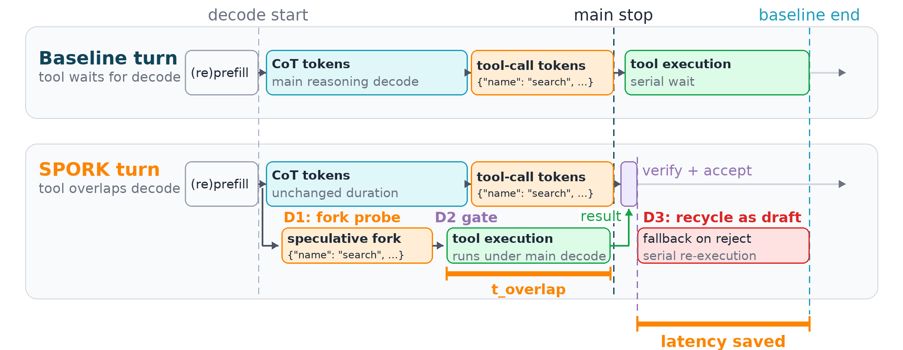
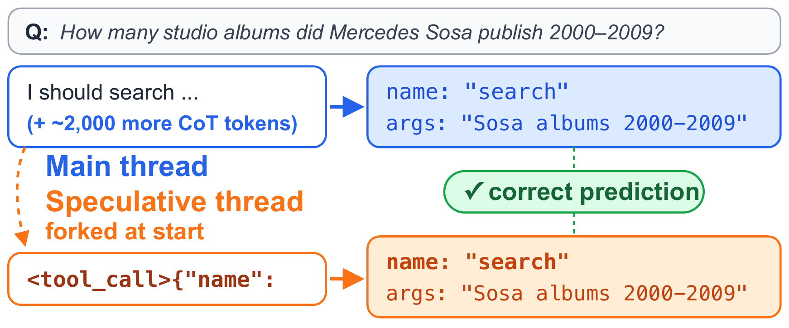

# SPORK

### Self-Speculative Forking to Accelerate Agentic LLM Inference

📄 **Paper:** [arXiv:2607.03333](https://arxiv.org/abs/2607.03333)

SPORK is a self-speculative tool-call probe for LLM agents. While the main
model is still decoding its chain-of-thought, a lightweight probe speculatively
predicts the upcoming tool call, dispatches it early, and **overlaps tool
execution with the remaining main decode**. When the probe is right, the tool
result is already available by the time the main model finishes its turn,
hiding tool latency behind decode time.

<p align="center">
  
</p>
<p align="center"><sub><b>A baseline turn vs. a SPORK turn.</b>
D1 forks a lightweight probe at decode start and dispatches the predicted tool
call early; D2 gates dispatch on probe confidence; the tool then runs under the
remaining CoT decode (<i>t_overlap</i>). On accept, the result is already
waiting at main stop; on reject, D3 recycles the probe's tokens as
speculative-decoding drafts for the serial fallback.</sub></p>

The probe runs against a vLLM OpenAI-compatible endpoint using `/v1/completions`
logprobs, and is most effective in **think mode** (Qwen3 emits multi-second
`<think>...</think>` CoT), which gives the probe enough decode time to finish
early and the tool time to overlap.

<p align="center">
  
</p>
<p align="center"><sub><b>Why it works: tool intent is visible early.</b>
A probe forked at the main thread's first token predicts the exact tool call
that the main thread only emits ~2,000 CoT tokens later.</sub></p>

## Results (from the paper)

SPORK reduces end-to-end agent **tail latency** by overlapping tool execution with
decode. Headline P95 results **from the paper** (full serving setup — see the paper
for complete tables, models, and ablations):

| Benchmark | Model | N | P95 latency vs baseline |
|---|---|---|---|
| τ²-bench | Qwen3.5-35B-A3B | 155 | **1.19×** (−16%) |
| GAIA | Qwen3-32B | 165 | **1.22×** (−18%) |
| HotpotQA | Qwen3.5-35B-A3B | 200 | **1.25×** (−19.7%, D1+D2) |

Quality is preserved (action-match / EM·F1 neutral within ±1–2 points). τ²-bench
Qwen3-4B also shows a 1.15× mean speedup (N=155).

**What this code reproduces.** This release faithfully reproduces the SPORK
*mechanism* — the probe predicts the next tool, dispatches it early, and overlaps it
with decode (verified at ~80% probe acceptance and per-task tool-overlap on
Qwen3-32B + τ²-bench). Exact latency gains are **serving- and N-dependent**: measure
with enough tasks that per-pass CoT-length variance averages out, and serve with
adequate parallelism so the probe does not contend with the main decode.
**τ²-bench is the most directly reproducible** here (public tau2-bench tools);
the paper's GAIA/HotpotQA used internal search services, so this release ships a
built-in Wikipedia backend for HotpotQA and a bring-your-own backend for GAIA
(see **Benchmarks & tool backends**). The D3 draft-injection numbers in the paper
are from the engine-mode integration; the HTTP `launch_vllm_qwen_spork.sh` path is
provided as a reference implementation of the same idea.

## Configs

`spork_unified_eval.py` evaluates a baseline against progressively richer SPORK
variants via `--configs`:

- `baseline` — no speculation; tool calls dispatched after the turn completes.
- `d1` (alias `spork`) — speculative probe + early tool dispatch (D1).
- `d1_d2` — D1 plus adaptive re-probing during decode (D2).
- `d1_d2_d3` — D1+D2 plus draft-token injection to accelerate main decode (D3).

**Serve-mode requirement:** `baseline`/`d1`/`d1_d2` run on the **plain** server
(`launch_vllm_qwen.sh`); `d1_d2_d3` requires the **SPORK-HTTP** server
(`launch_vllm_qwen_spork.sh`, which adds ngram spec-dec + the draft-injection
sidecar). See **Serving the model**.

## Prerequisites

- **Python 3.10+**.
- **vLLM** with an OpenAI-compatible server (see `launch_vllm_qwen.sh`).
- **A Qwen3 model** (e.g. `Qwen/Qwen3-32B`). Other Qwen3 sizes work too.
- **tau2-bench** installed and importable on `PYTHONPATH` (its `src/` on the
  path). Point `SPORK_TAU2_ROOT` at your checkout if it is not under the repo.
- Python deps from `requirements.txt` (`pip install -r requirements.txt`).
- For `hotpotqa`: a local dataset JSONL (Wikipedia backend is built in — no key).
  For `gaia`: a local dataset JSONL **and** your own web search/browse backend
  (see **Benchmarks & tool backends** below).

## Serving the model

There are **two serve modes**, depending on which SPORK configs you want to run:

**(a) Plain serve — for `baseline`, `d1`, `d1_d2`** (the HTTP probe + tool-overlap path):

```bash
MODEL_PATH=Qwen/Qwen3-32B PORT=8000 TP=4 ./launch_vllm_qwen.sh
```

**(b) SPORK-HTTP serve — additionally enables `d1_d2_d3`** (D3 = ngram speculative
decoding + a `/spork/*` sidecar that injects the probe's predicted tool-call
tokens at the boundary to accelerate the main decode):

```bash
MODEL_PATH=Qwen/Qwen3-32B PORT=8000 TP=4 ./launch_vllm_qwen_spork.sh
```

`MODEL_PATH`, `PORT`, `TP`, `MAX_LEN`, `GPU_UTIL` (and `NSPEC` for mode b) are all
overridable via environment variables. Mode (b) also serves `baseline`/`d1`/`d1_d2`
(D3 is simply unused for them), but its `baseline` runs *with* ngram self-speculation
(an "ngram baseline") — so for a clean D3 ablation compare `d1_d2_d3` against the
`baseline` measured on the **same** (mode b) server.

## Running an evaluation

```bash
PYTHONPATH=. python3 spork_unified_eval.py \
    --model-url http://localhost:8000/v1 \
    --model-name qwen3-32b \
    --benchmark tau2 \
    --configs baseline,d1_d2 \
    --n 40 \
    --enable-thinking
```

This runs 40 tau2 tasks for both the `baseline` and `d1_d2` configs and writes
per-config results under the results root (override with `--results-root`).
Add `d1` and/or `d1_d2_d3` to `--configs` to compare more variants.

`--benchmark` accepts `tau2` (default), `gaia`, and `hotpotqa`. **HotpotQA runs
out-of-the-box** via a built-in Wikipedia backend (no API key); **GAIA** needs a
dataset path **and** your own search/browse backend (see **Benchmarks & tool
backends**):

```bash
PYTHONPATH=. python3 spork_unified_eval.py \
    --model-url http://localhost:8000/v1 --model-name qwen3-32b \
    --benchmark gaia --configs baseline,d1_d2 --n 165 \
    --gaia-dataset-path ./datasets/gaia_validation.jsonl

PYTHONPATH=. python3 spork_unified_eval.py \
    --model-url http://localhost:8000/v1 --model-name qwen3-32b \
    --benchmark hotpotqa --configs baseline,d1_d2 --n 200 \
    --hotpotqa-dataset-path ./datasets/hotpotqa_validation.jsonl
```

## Benchmarks & tool backends

This release demonstrates SPORK's **latency-overlap mechanism**. We use these
benchmarks as realistic tool-agent **workloads** for latency measurement, not as
official leaderboard scores — the reported success is only a *same-harness
`baseline` ≈ `d1_d2` quality-preservation check* (see the note on tau2 below).

| benchmark | out of the box? | tool backend |
|---|---|---|
| **tau2** | ✅ yes — install tau2-bench | tau2-bench's own tool environment (real DB ops). We run a **single-turn, no-user-simulator** harness, so success is **action-match**, *not* τ²-bench's official user-simulator (DB×communicate) reward — don't compare it to the τ²-bench leaderboard. |
| **HotpotQA** | ✅ yes — **no API key** | built-in **Wikipedia** backend (`WikipediaSearchBackend`). HotpotQA is Wikipedia QA, so this is faithful and reproducible. Uses the public MediaWiki API (honors `http(s)_proxy` env vars). |
| **GAIA** | ⚠️ bring your own | placeholder `WebSearchBackend` / `WebBrowseBackend` (raise `NotImplementedError`). GAIA needs general web search/browse — plug in SerpAPI / Bing / a headless browser in [`tool_backends.py`](tool_backends.py) and it will run. The paper used internal search services not included here. |

The GAIA/HotpotQA tool **schemas**, system prompts, task loaders (local JSONL),
and the EM/F1 scorer are all included. To add your own backend, subclass
`WebSearchBackend.search(query, top_k) -> list[{title, url, snippet}]` and/or
`WebBrowseBackend.browse(url, goal) -> str` in `tool_backends.py`.

Datasets are read from local JSONL: HotpotQA expects `question`/`answer` fields;
GAIA expects `Question`/`Final answer`. Paths default to
`./datasets/{gaia,hotpotqa}_validation.jsonl` and are overridable via
`--gaia-dataset-path` / `--hotpotqa-dataset-path` (or `SPORK_GAIA_DATASET` /
`SPORK_HOTPOTQA_DATASET`).

## Citation

If you use SPORK in your research, please cite:

```bibtex
@misc{bai2026spork,
  title         = {SPORK: Self-Speculative Forking to Accelerate Agentic LLM Inference},
  author        = {Bai, Huajun and Lv, Weiwei and Zheng, Huichuan and Lu, Youyou and Shu, Jiwu},
  year          = {2026},
  eprint        = {2607.03333},
  archivePrefix = {arXiv},
  primaryClass  = {cs.DC}
}
```
